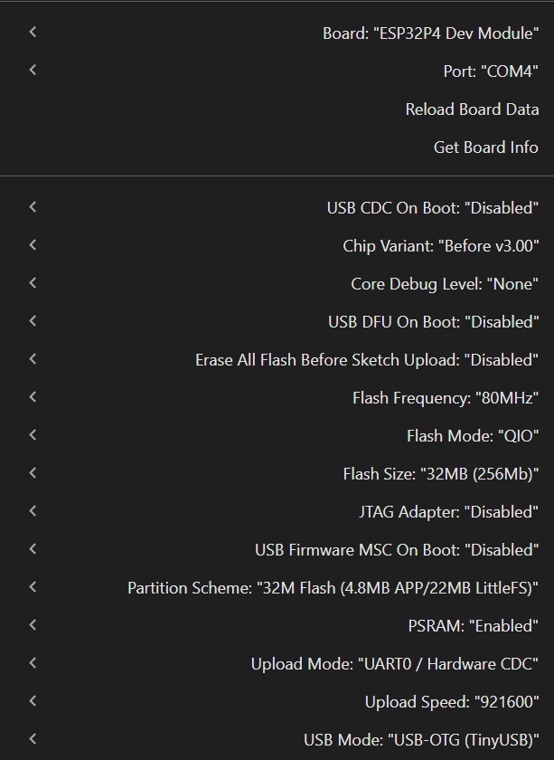

# FastTLM-ESP32
Fast Tiny Language Model inference engine adapted and optimized for **ESP32-P4** & **ESP32**.

---

## 🌟 Acknowledgments & Full Credit

**All original model architecture, concept, training, and initial implementation credit goes to [Asad Shafi](https://github.com/asad-shafi).**

This repository is a fork / enhanced version of the original work:
- 📦 **Original GitHub Repository:** [Running-Tiny-Lanuage-Model-on-ESP32](https://github.com/asad-shafi/Running-Tiny-Lanuage-Model-on-ESP32)
- 📖 **Original Hackster.io Article:** [Run Tiny Language Model / GenAI on ESP32](https://www.hackster.io/asadshafi5/run-tiny-language-model-genai-on-esp32-8b5dd8)

### What was improved in this version:
- 🚀 **Ported & Adapted for ESP32-P4**: Leveraged the dual-core RISC-V architecture and high-bandwidth memory of the new ESP32-P4 chip.
- ⚡ **Significant Performance Boost**: Through memory layout optimizations in PSRAM, dual-core task scheduling, and O(1) hash tokenizer lookup, inference speed was dramatically improved.
- 🛠️ **Memory & Stability Fixes**: Safe heap allocations for logits and activations to prevent stack/heap overflows.

---

## ⚡ Performance & Benchmark (ESP32-P4)

Tested on **ESP32-P4**:
- **Output:** `32 tokens in 5416 ms`
- **Throughput:** **`5.91 tokens/sec`**

---

## ⚙️ Arduino IDE Configuration & Board Settings

To compile and flash the project successfully, configure the board settings in the Arduino IDE as follows:

- **Flash Size:** `32MB (256Mb)`
- **Partition Scheme:** `32M Flash (4.8MB APP/22MB LittleFS)`
- **PSRAM:** `Enabled` (Required for weights, model activations, and logits buffer)

### Board Settings Screenshot

*(File path: `C:\Users\ישראל\Desktop\onnx-duino\TLM\TLM\img.png`)*

---

## ✨ Key Features
- 🛜 **Fully Offline:** No cloud connection required. All inference happens locally on the ESP32.
- 🔒 **Privacy-First:** User data never leaves the device.
- ⚡ **High Performance on Edge:** Utilizes PSRAM allocations, hash-based O(1) tokenizer lookup, and multi-core acceleration.
- 💰 **Cost-Effective:** Runs on standard edge hardware.

---

## 📋 Hardware Requirements
- **ESP32-P4** or **ESP32-S3** development board with PSRAM support (minimum 8MB/16MB/32MB PSRAM recommended)
- 32MB Flash module
- USB cable for programming and serial monitoring

---

## 🧩 Software Requirements
- **Arduino IDE** (with ESP32 board support package installed)
- Serial monitor baud rate set to `115200`

---

## 🔗 Credits & References
- Original Author: [Asad Shafi](https://github.com/asad-shafi)
- Original Project: [Running-Tiny-Lanuage-Model-on-ESP32](https://github.com/asad-shafi/Running-Tiny-Lanuage-Model-on-ESP32)
- Hackster Project: [Run Tiny Language Model / GenAI on ESP32](https://www.hackster.io/asadshafi5/run-tiny-language-model-genai-on-esp32-8b5dd8)

